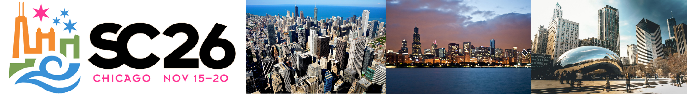
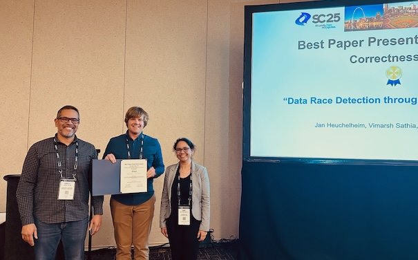

<h2>Correctness 2026: 10th International Workshop on Software Correctness for HPC Applications</h2>

<h4> November 16, 2026 (half day, 9:00am - 12:30pm CST) </h4>

<h4> McCormick Place (Convention Center) </h4>

<h4> Chicago, IL, USA </h4>

<h5> Held in conjunction with SC26: <a href="https://sc26.supercomputing.org/">The International Conference for High Performance Computing, Networking, Storage and Analysis</a> </h5>

In cooperation with  

<!--

-->

----

Ensuring correctness in high-performance computing (HPC) applications is one of the fundamental challenges that the HPC community faces today. While significant advances in verification, testing, and debugging have been made to isolate software errors (or defects) in the context of non-HPC software, several factors make achieving correctness in HPC applications and systems much more challenging than in general systems software—growing heterogeneity (architectures with CPUs, GPUs, and special purpose accelerators), massive scale computations (very high degree of concurrency), use of combined parallel programing models (e.g., MPI+X), new scalable numerical algorithms (e.g., to leverage reduced precision in floating-point arithmetic), and aggressive compiler optimizations/transformations are some of the challenges that make correctness harder in HPC. The following reports lay out the key challenges and research areas of HPC correctness: (1) [DOE Report of the HPC Correctness Summit](https://www.osti.gov/biblio/1470989), (2) [DOE/NSF Workshop on Correctness in Scientific Computing](https://arxiv.org/pdf/2312.15640).

As the complexity of future architectures, algorithms, and applications in HPC increases, the ability to fully exploit exascale systems will be limited without correctness. With the continuous use of HPC software to advance scientific and technological capabilities, novel techniques and practical tools for software correctness in HPC are invaluable.

The goal of the Correctness Workshop is to bring together researchers and developers to present and discuss novel ideas to address the problem of correctness in HPC. The workshop will feature contributed papers and invited talks in this area.

----
### <a class="anchor" name="topics">Workshop Topics</a>

Topics of interest include, but are not limited to:

#### Correctness in Scientific Applications and Algorithms
* Formal methods and rigorous mathematical techniques for correctness in HPC applications
* Frameworks to address the challenges of testing complex HPC applications (e.g., multiphysics applications)
* Approaches for the specification of numerical algorithms with the goal of correctness checking
* Error identification in the design and implementation of numerical algorithms using finite-precision floating point numbers

#### Tools for Debugging, Testing, and Correctness Checking
* Corerctness checking assisted by AI
* Program synthesis techniques for testing and debugging HPC applications
* Tools to control the effect of non-determinism when debugging and testing HPC software
* Scalable debugging solutions for large-scale HPC applications
* Scalable tools for model checking, verification, certification, or symbolic execution
* Static and dynamic analysis to test and check correctness in the entire HPC software ecosystem
* Predictive debugging and testing approaches to forecast the occurrence of errors in specific conditions
* Machine learning and anomaly detection for bug detection and localization

#### Programing Models and Runtime Systems Correctness
* Correctness in emerging HPC programing models
* Analysis of software error propagation and error handling in HPC runtime systems and libraries
* Metrics to measure the degree of correctness of HPC software
* Specifications to check the correctness of runtime systems

#### Other Areas
* Large databases of bug reports and/or reproducible test cases of HPC software
* Benchmarks to test the effectiveness of HPC correctness tools

----
### <a class="anchor" name="submissions"> Submissions and Format </a>

Authors are invited to submit manuscripts in English structured as technical or experience papers in 
any of these categories: (a) **regular papers:** with a length of at least **7 pages**, not exceeding **8 pages** of content, 
including everything except references; (b) **short papers:** with a length of **4 pages** including everything except for references. 

The submissions are single-blind, i.e., authors of papers may include their names and affiliations.

~~Submissions must use the [ACM proceedings template](https://www.acm.org/publications/proceedings-template) (Latex users, please use the "sigconf" option).~~
Submissions must use the IEEE conference templates.

<!--Submitted papers will be peer-reviewed by the Program Committee and accepted papers will be published by IEEE Xplore via TCHPC.-->
Submitted papers will be peer-reviewed by the Program Committee and accepted papers will be published by ACM.

Submitted papers must represent original unpublished research that is not currently under review for any other venue. Papers not following these guidelines will be rejected without review. Submissions received after the due date, exceeding length limit, or not appropriately structured may also not be considered. At least one author of an accepted paper must register for and attend the workshop. Authors may contact the workshop organizers for more information. Papers should be submitted electronically at: [https://submissions.supercomputing.org/](https://submissions.supercomputing.org/).

#### SC Reproducibility Initiative

We encourage authors to submit an **optional** artifact description (AD) appendix along with their paper, describing the details of their software environments and computational experiments to the extent that an independent person could replicate their results. The AD appendix is not included in the 8-page limit of the paper and should not exceed **2 pages** of content. For more details of the **SC Reproducibility Initiative** please see: [https://sc24.supercomputing.org/program/papers/reproducibility-initiative/](https://sc24.supercomputing.org/program/papers/reproducibility-initiative/).

---

<!--
###  <a class="anchor" name="submissions"> HPC Bug Fest </a>
This year again, we have the [HPC Bug Fest](https://sites.google.com/view/hpc-bugs-fest/home), a session that will focus on correctness benchmarks. The goal is to provide a detailed snapshot of the state-of-the-art HPC verification tools by both discussing their methodologies and comparing their evaluation metrics. 

This session only accepts short papers based on four different contributions: (1) 
codes to expand existing benchmarks, (2) new metrics to evaluate verification tools, (3) new results to track tools updates, and (4) 
real world cases of error correction. An artefact description is 
mandatory to ensure reproducibility. 

More information on the website: [https://sites.google.com/view/hpc-bugs-fest/home](https://sites.google.com/view/hpc-bugs-fest/home)

HPC Bug Fest papers must be submitted electronically using the "Correctness Short Papers" form at: [https://submissions.supercomputing.org/](https://submissions.supercomputing.org/).
-->

----

###  <a class="anchor" name="proceedings"> Proceedings </a>

The proceedings will be archived in ACM.

---
### <a class="anchor" name="dates"> Important Dates </a>

* Paper submissions due: ~~July 23rd, 2026~~ **Extended (firm deadline):** July 30, 2026
* Notification of acceptance: September 1st, 2026
* E-copyright registration completed by authors: TBD
* Camera-ready papers due: TBD

<!--
* Paper submissions due: ~~July 18, 2025~~ ~~**Extended:** August 1, 2025~~ **Extended:** August 3, 2025
* Notification of acceptance: ~~August 22, 2025~~ **Extended:** September 5, 2025
* E-copyright registration completed by authors: TBD
* Camera-ready papers due: TBD
-->

All time zones are AOE.

---
### <a class="anchor" name="date">Workshop Date</a>

- Half-day Workshop
- November 16, 2026, 9:00am - 12:30pm CST

---
### <a class="anchor" name="org">Organizers</a>

[Ignacio Laguna](http://lagunaresearch.org/), LLNL  
[Cindy Rubio-González](http://web.cs.ucdavis.edu/~rubio/), UC Davis

---
### <a class="anchor" name="pc">Program Committee</a>

[Alper Altuntas](https://staff.ucar.edu/users/altuntas), National Center for Atmospheric Research, USA  
[Ali Jannesari](https://www.cs.iastate.edu/people/ali-jannesari), Iowa State University, USA  
[Allison H. Baker](https://staff.ucar.edu/users/abaker), National Center for Atmospheric Research, USA  
[John Baugh](https://www.ccee.ncsu.edu/people/jwb/), North Carolina State University, USA  
[Patrick Carribault](http://www.cea.fr/), CEA-DAM, France   
[Ganesh Gopalakrishnan](https://www.cs.utah.edu/~ganesh/), University of Utah, USA  
[Jan Hueckelheim](https://www.anl.gov/profile/jan-huckelheim), Argonne National Laboratory, USA  
[Alexander Hück](https://www.informatik.tu-darmstadt.de/sc/fg/people/details/alexander_hueck.en.jsp), Technical University of Darmstadt, Germany  
[Michael O. Lam](https://w3.cs.jmu.edu/lam2mo/), James Madison University, USA  
[Jacob Laurel](https://jsl1994.github.io/), Georgia Institute of Technology, USA  
[Jackson Mayo](http://www.sandia.gov/), Sandia National Laboratories, USA  
[Erdal Mutlu](https://www.pnnl.gov/people/erdal-mutlu), Pacific Northwest National Laboratory, USA  
[Sreepathi Pai](https://cs.rochester.edu/~sree/), University of Rochester, USA  
[Pavel Panchekha](https://pavpanchekha.com/), University of Utah, USA  
[Samuel	Pollard](https://scholar.google.com/citations?user=X0zJ484AAAAJ&hl=en), Sandia National Laboratories, USA  
[Emmanuelle Saillard](https://emmanuellesaillard.fr/), INRIA, France  
[Simon Schwitanski](#), NVIDIA, USA  
[Matt Sottile](https://scholar.google.com/citations?user=q6Z0FZMAAAAJ&hl=en), Lawrence Livermore National Laboratory, USA  
[Mohit Tekriwal](https://mohittkr.github.io/), Lawrence Livermore National Laboratory, USA  

<!--
[Lechen Yu](http://lechenyu.io/), Microsoft, USA  
[Joachim Jenke](#), RWTH Aachen University, Germany   
[Balthasar Reuter](https://www.ecmwf.int/en/about/who-we-are/staff-profiles/balthasar-reuter), European Centre for Medium-Range Weather Forecasts, UK  
-->

---
### <a class="anchor" name="venue">Venue</a>

- McCormick Place (Convention Center), Chicago, IL, USA
- Room: XX

---
### <a class="anchor" name="program">Program</a>
 

TBD

<!--
#### Workshop Introduction
<table>
<tr><td width="15">  </td> <td>9:00am - 9:05am:  <b>Opening Remarks</b>, Ignacio Laguna (LLNL), Cindy Rubio-González (UC Davis)</td> </tr>
</table>

#### Invited Talk
<table>
<tr><td width="15">  </td> <td>9:05am - 10:00am:  <b>Featured Speaker:</b> Prof. Dr. Matthias Müller (RWTH Aachen University): <i>"Runtime Correctness Checking with MUST and Assisting Tools"</i> </td> </tr>
</table>

#### Break
<table>
<tr><td width="15">  </td> <td> 10:00am - 10:30am:  Break </td> </tr>
</table>

#### Correctness in Parallel Code (MPI, OpenMP, and Beyond) (Chair: Cindy Rubio-González)
<table>

<tr><td width="15">  </td> <td>10:30am - 10:55am:  Paper 1:  <b>"Using Code Coverage to Assess Feature Gaps in MPI Correctness Tool Classification Tests"</b>,  Alexander Hück, Simon Schwitanski, Tim Jammer, Joachim Jenke, Yussur Mustafa Oraji, Christian Bischof </td> </tr>

<tr><td width="15">  </td> <td>10:55am - 11:20am:  Paper 2:  <b>"Coupling Static and Dynamic MPI Correctness Tools to Optimize Accuracy and Overhead"</b>, Yussur Mustafa Oraji, Simon Schwitanski, Semih Burak, Christian Bischof, Matthias Müller</td> </tr>

<tr><td width="15">  </td> <td>11:20am - 11:45am:  Paper 3:  <b>"Data Race Detection through Vibe Translation"</b>, Jan Hueckelheim, Vimarsh Sathia, Siyuan Brant Qian</td> </tr>

<tr><td width="15">  </td> <td>11:45am - 12:10pm:  Paper 4:  <b>"Differential Testing for Sequential to Parallel Transformations"</b>, Jobayer Ahmmed, Quazi I. Mahmud, Junhyung Shim, Liyi Li, Ali Jannesari, Myra B. Cohen</td> </tr>

<tr><td width="15">  </td> <td>12:10pm - 12:30pm:  Paper 5 (Short paper):  <b>"Extending MPI Correctness Benchmarking to the Fortran Language"</b>, Yussur Mustafa Oraji, Alexander Hück, Christian Bischof</td> </tr>
</table>

#### Lunch Break
<table>
<tr><td width="15">  </td> <td> 12:30pm - 2:00pm:  Lunch Break </td> </tr>
</table>

#### Invited Talk
<table>
<tr><td width="15">  </td> <td>2:00pm - 3:00pm: <b>Featured Speaker:</b> Prof. Ali Jannesari (Iowa State University): <i>"Correct and Efficient HPC Code Generation with LLMs: Challenges and Opportunities"</i></td> </tr>
</table>

#### Break
<table>
<tr><td width="15">  </td> <td> 3:00pm - 3:30am:  Break </td> </tr>
</table>

#### Numerical Correctness (Chair: Ignacio Laguna)
<table>
<tr><td width="15">  </td> <td>3:30pm - 3:55pm:  Paper 6: <b>"Towards an Automated Workflow for Floating-Point Analysis of GPU Kernels"</b>, Esteban M. Rangel, S. John Pennycook</td> </tr>

<tr><td width="15">  </td> <td>3:55pm - 4:20pm:  Paper 7: <b>"LLM4FP: LLM-Based Program Generation for Triggering Floating-Point Inconsistencies Across Compilers"</b>, Yutong Wang, Cindy Rubio-González</td> </tr>

<tr><td width="15">  </td> <td>4:20pm - 4:45pm:  Paper 8: <b>"Exploring Reduced Precision for Deep Learning Activation Functions"</b>, Epifanio Sarinana, Christoph Lauter, Shirley Moore</td> </tr>
</table>

#### Lightning Talks
<table>
<tr><td width="15">  </td> <td>4:45pm - 5:25pm: <b>Emerging Tools Lightning Talks Session</b>: featuring short presentations about emerging correctness tools. </td></tr>

<tr> <td width="15"> </td> <td>• <i>"Scabbard: LLVM Instrumentation-aided Race Checking in CPU/GPU Unified Memory for AMD GPUs"</i>, Andrew Osterhout (Univ. of Utah)</td></tr>
<tr> <td width="15"> </td> <td>• <i>"Scalable formal verification of scientific computing libraries"</i>, Mohit K. Tekriwal (LLNL)</td></tr>
<tr> <td width="15"> </td> <td>• <i>"Data Race Detection by Concentrating on Instrumentation"</i>, Tim Jammer (TU Darmstadt)</td></tr>
<tr> <td width="15"> </td> <td>• <i>"Using FloatGuard to detect floating point exceptions in AMD GPU programs"</i>, Dolores Miao (UC Davis)</td></tr>

</table>

#### Best Paper Presentation Award
<table>
<tr><td width="15">  </td> <td>5:25pm - 5:30pm: Best Paper Presentation Award </td> </tr>
<tr><td width="15">  </td> <td>5:30pm: Adjourn </td> </tr>
</table>

-->

---
###  <a class="anchor" name="award">Best Presentation Award</a>

Like in previous years, we will have the **Best Presentation Award**. The goal is to reward high-quality presentations, motivating speakers at the workshop to deliver their best work. We believe that advancing the field of Correctness in HPC requires more engagement and collaboration between the research, development, and applications communities, and better presentations will lead to more engaging and informative sessions. Higher quality presentations will also help us to present the benefits of Correctness methods to our sponsors. 

A high-quality presentation should present clearly the correctness problem being addressed and its impact to scientific / HPC applications, and it should be easy to follow even for attendees that are not familiar with traditional correctness methods (formal methods, verification, testing, debugging, among others). Overall the presentation should make such methods and results more accessible to the general audience of the workshop and the SC community.

Only regular papers are eligible for the Best Presentation Award (short papers are not eligible).

#### Winner

TBD

<!--

The winner of the **Best Paper Presentation Award** is the paper "Data Race Detection through Vibe Translation", 
co-authored by Jan Hueckelheim, Vimarsh Sathia, and Siyuan Brant Qian. Congratulations!

-->

---
###  <a class="anchor" name="contact">Contact Information</a>
Please address workshop questions to [Ignacio Laguna](https://lagunaresearch.org/) (ilaguna@llnl.gov) and/or [Cindy Rubio-González](https://web.cs.ucdavis.edu/~rubio/) (crubio@ucdavis.edu).

---
### <a class="anchor" name="previous">Previous Workshops</a>
- [Correctness 2025](https://correctness-workshop.github.io/2025/)
- [Correctness 2024](https://correctness-workshop.github.io/2024/)
- [Correctness 2023](https://correctness-workshop.github.io/2023/)
- [Correctness 2022](https://correctness-workshop.github.io/2022/)
- [Correctness 2021](https://correctness-workshop.github.io/2021/)
- [Correctness 2020](https://correctness-workshop.github.io/2020/)
- [Correctness 2019](https://correctness-workshop.github.io/2019/)
- [Correctness 2018](https://correctness-workshop.github.io/2018/)
- [Correctness 2017](https://correctness-workshop.github.io/2017/)

